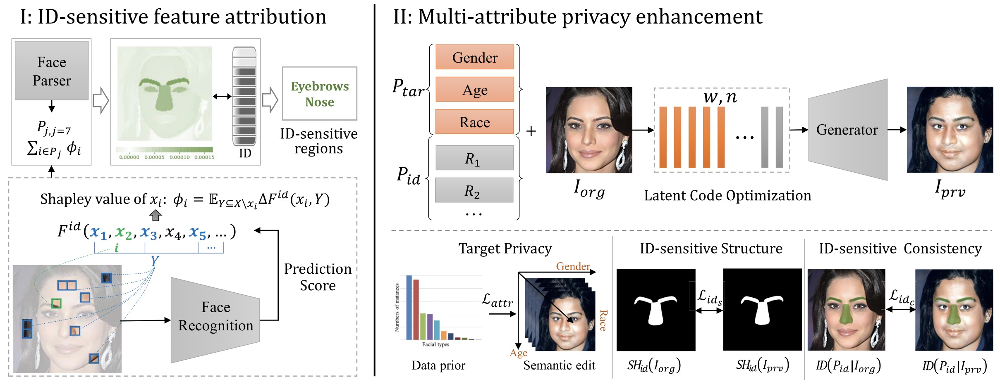

# Privacy Enhancing Face Obfuscation
[T-IFS 2023] Privacy-enhancing face obfuscation guided by semantic-aware attribution maps

If you like our project, please give us a star ⭐ on GitHub for latest update.



## 🐳 Model Zoo

|File Name| BaiduYun | Extract code |
|-|-|-|
|Pre-trained Model|[https://pan.baidu.com/s/1xgm6QMXr9UiyOVhsqY2JDA](https://pan.baidu.com/s/1xgm6QMXr9UiyOVhsqY2JDA)|`dpyi`|
|Json file|[https://pan.baidu.com/s/1r6h95eXAR95iD5houxLZBQ](https://pan.baidu.com/s/1r6h95eXAR95iD5houxLZBQ)|`rgep`|
|Shapley Value images|[https://pan.baidu.com/s/1kbdrG60J5i-1csXALad2oA](https://pan.baidu.com/s/1kbdrG60J5i-1csXALad2oA)|`xk8k`|

## 🛠️ Environment

Please refer to MaskFaceGAN for environment setup: [https://github.com/MartinPernus/MaskFaceGAN](https://github.com/MartinPernus/MaskFaceGAN).

## 🗝️ How to Run

After downloading the relevant files and installing the environment, run it directly, for example:

```python
python main2-v1.py
```

The relevant main files include: `main.py`, `main2-v1.py`, `main2.py`, `main3.py`, `main-age-race.py`, `main-race.py`.

## 👍 Acknowledgement

[MaskFaceGAN](https://github.com/MartinPernus/MaskFaceGAN): a method for high resolution face editing through the use of constraints on GAN inpainted image regions.

[Shap](https://github.com/shap/shap): a game theoretic approach to explain the output of any machine learning model.

[FaceTechnologyTool](https://github.com/RuoyuChen10/FaceTechnologyTool): a collection of code commonly used to process face technology, support average face computing, face attributes recognition, face recognition, face segmentation, face verification, and grad-cam for face identification algorithms.

[insightface](https://github.com/deepinsight/insightface): State-of-the-art 2D and 3D Face Analysis Project

## ✏️ Citation

```bibtex
@article{li2023privacy,
  title={Privacy-enhancing face obfuscation guided by semantic-aware attribution maps},
  author={Li, Jingzhi and Zhang, Hua and Liang, Siyuan and Dai, Pengwen and Cao, Xiaochun},
  journal={IEEE Transactions on Information Forensics and Security},
  year={2023},
  publisher={IEEE}
}
```